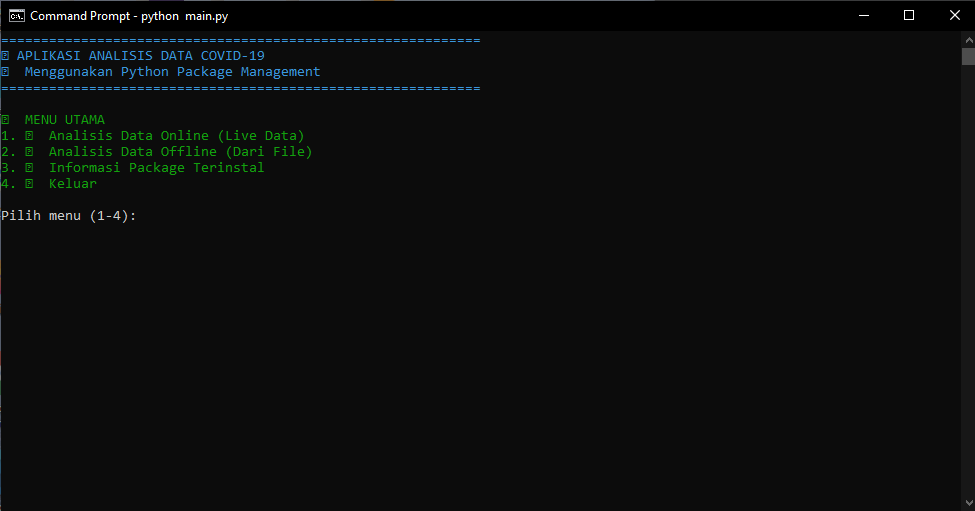
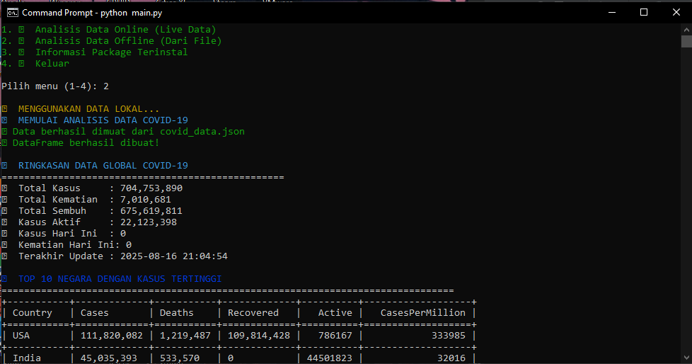
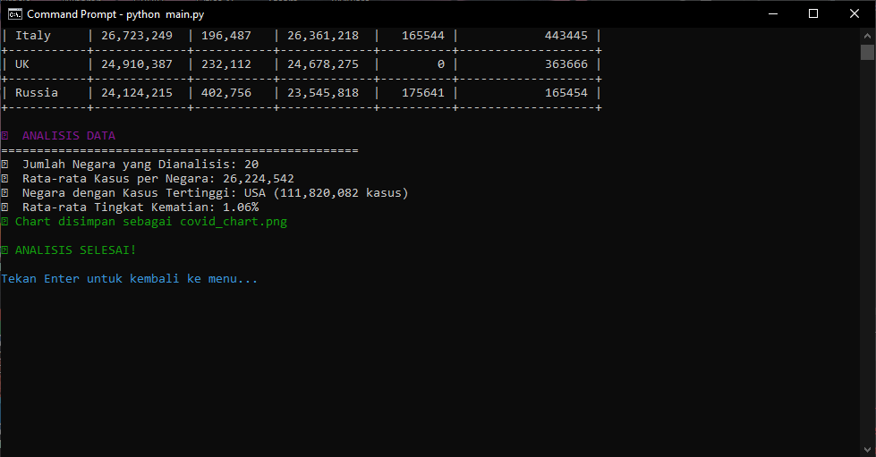
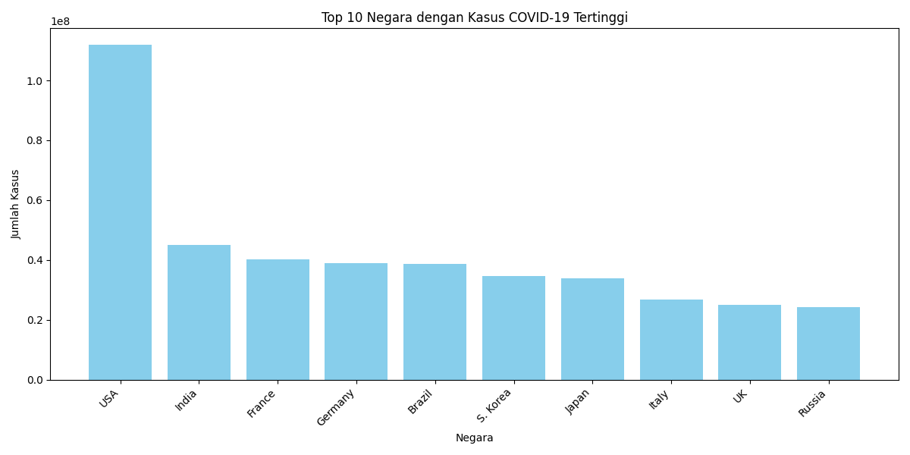

🦠 COVID-19 Data Analyzer (Indonesian Languages)

A simple yet powerful Python CLI app that fetches, analyzes, and visualizes global COVID-19 data using the disease.sh API.

- 🚀 Features

- 🌐 Live Data from API or Offline Mode (using saved JSON)

- 📊 Data Analysis powered by Pandas

- 📈 Visualization with Matplotlib (saved as .png)

- 🎨 Colorful Terminal Interface with Colorama

- 💾 Auto-Saves Data to covid_data.json

- 📦 Package Info Viewer

- ⚡ Lightweight & Easy to Use

- 🛠️ Tech Stack

Python 3

Libraries: requests, pandas, matplotlib, colorama, tabulate

▶️ How to Run
# 1. Install dependencies
pip install requests, pandas, matplotlib, colorama, tabulate

# 2. Run the app (Using CMD for Windows/ CLI for MAC)
- covid_env\Scripts\activate
- python main.py

📷 Screenshots

✅ Main Menu

✅ Menu 1: Online Analyzer (whenever your connections trouble, it will throw the Offline system [Menu 2 already])

✅ Menu 2: Offline Analyzer

✅ Image export (Matplotlib)

✅ Chart image (Matplotlib)

🙌 Credits

API: disease.sh – Open Disease Data for the World
